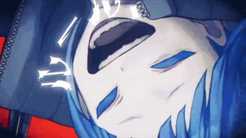
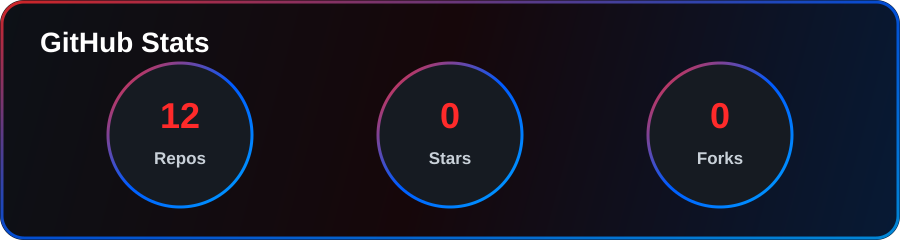
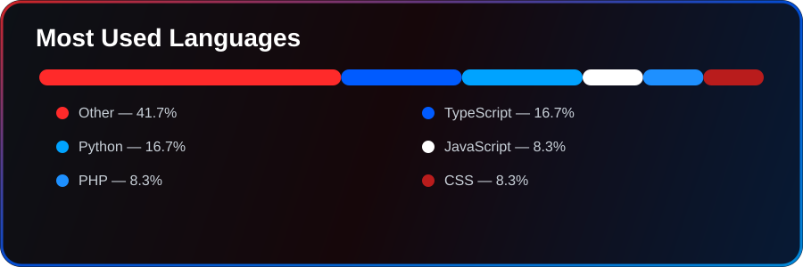
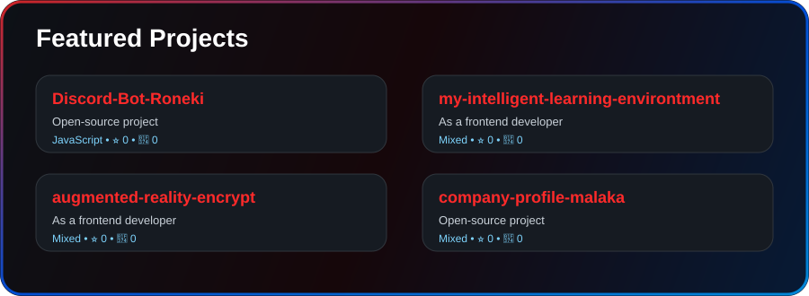
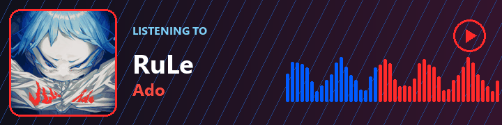

---

## 🌸 About Me

- 🎯 Focused on frontend development
- 🏢 Part of **Roneki Media**
- 💻 Building clean web apps with smooth UX
- ⚡ Main stack: **PHP**, **TypeScript**, **JavaScript**
- 🍜 Anime-coded mindset: learn, build, repeat
- 📌 GitHub: [@akmalgt28](https://github.com/akmalgt28)

---

## 🌐 Connect With Me

---

## 🛠️ Tech Stack

---

## 📊 GitHub Stats

 
 

---

## 🚀 Featured Projects

---

## 🎧 Listening To

 

**RuLe — Ado**

---

### Thanks for visiting my profile ✨

